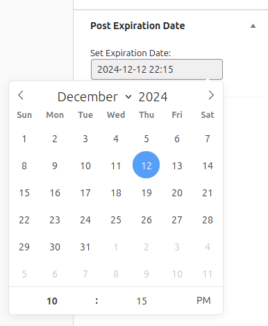

# Post Expiration Manager

**Post Expiration Manager** is a WordPress plugin that lets you set expiration dates on posts, automatically unpublishing, archiving, or moving them once they expire. Perfect for blogs, news sites, and any content-driven website needing automated content management.

## Features

- Set an expiration date and time for each post.
- Automatically unpublishes expired posts (moves them to "Draft").
- Supports custom expiration actions (e.g., unpublish, archive, delete).
- Compatible with the WordPress scheduling system to check expiration hourly.
- Date-time picker for easy selection of expiration date and time.

## Installation

1. **Download the Plugin**: Download the plugin as a ZIP from GitHub.
2. **Upload to WordPress**:
   - In your WordPress dashboard, go to **Plugins > Add New**.
   - Click **Upload Plugin** and select the downloaded ZIP file.
   - Click **Install Now** and activate the plugin.
3. **Verify Activation**: You should see a new **Post Expiration Date** meta box in your post editor.

## Usage

1. **Set Expiration Date and Time**:
   - Go to **Posts > Add New** or edit an existing post.
   - In the **Post Expiration Date** meta box, set the desired expiration date and time using the date-time picker.
   - Save or update the post.
   
2. **Automatic Expiration**:
   - Every hour, the plugin checks for posts that have reached their expiration date.
   - Expired posts are automatically moved to "Draft" status.

3. **Manual Trigger (Optional)**:
   - If you want to manually trigger the expiration check, you can use a plugin like [WP Crontrol](https://wordpress.org/plugins/wp-crontrol/) to run the scheduled event `content_expiration_check`.

## Screenshots

1. **Meta Box**: 
   - Screenshot showing the date-time picker in the Post Expiration Date meta box.

## Requirements

- WordPress 5.0 or later
- PHP 7.0 or later

## Troubleshooting

- **Date-Time Picker Not Showing**: If the date-time picker is missing, ensure that JavaScript is enabled in your browser. Additionally, check for theme or plugin conflicts by deactivating other plugins temporarily.
- **Cron Not Running**: WordPress cron depends on site traffic. If your site has low traffic, consider setting up a real cron job on the server to ensure regular execution.

## Changelog

### Version 1.0
- Initial release with date-time expiration and automatic unpublishing.

## Contributing

Contributions are welcome! Please fork the repository and submit a pull request.

---

Enjoy using Post Expiration Manager? [Star](https://github.com/himanshutecstub/wp-post-expiration) the project on GitHub and share with the community!
